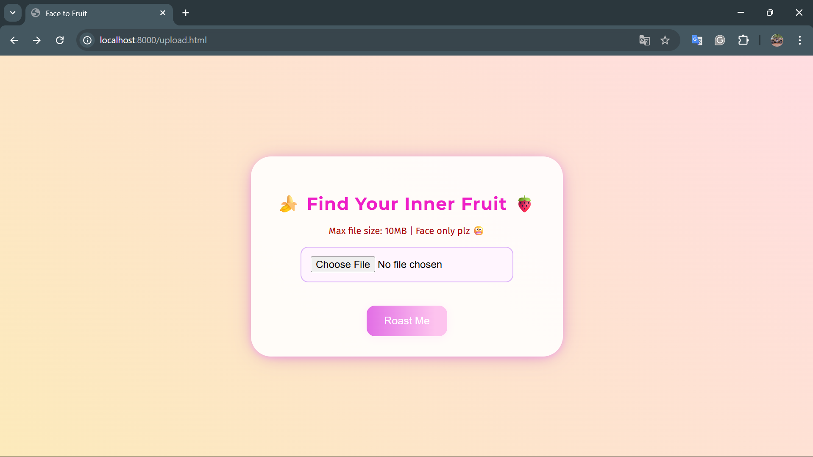
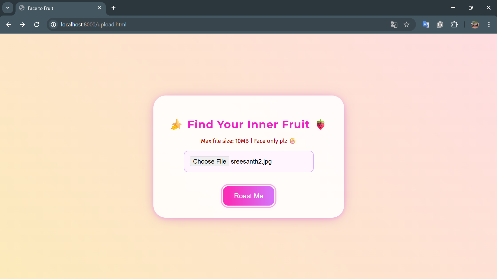
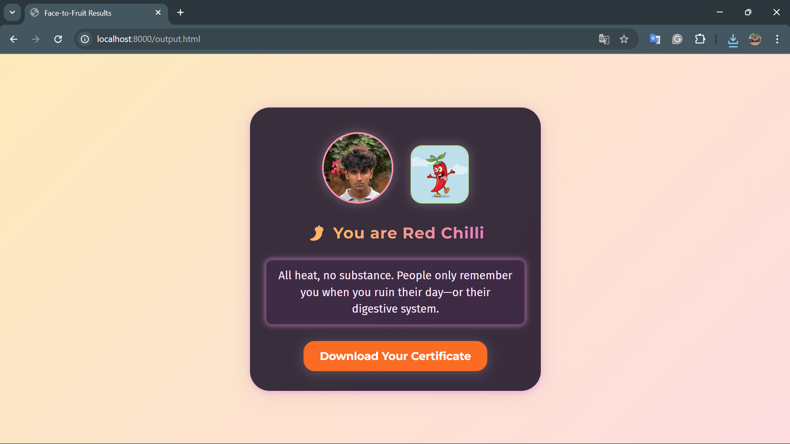

# Roastberry-Pi 🎯

## Basic Details
### Team Name: MAIN

### Team Members
- Team Lead: Yadu S Rajeev - TKM College of Engineering, Kollam
- Member 2: Vaishnav V Bishoy - TKM College of Engineering, Kollam

### Project Description
Face-to-Fruit is a comic-themed web app that hilariously matches your selfie to a fruit or veggie and roasts you with a savage, personalized caption.

### The Problem (that doesn't exist)
Not enough people know which vegetable or fruit they spiritually resemble. The world lacks official roast certificates from produce.

### The Solution (that nobody asked for)
A face detection-powered web app that assigns you your "spirit produce" and roasts you based on your face's vibe. Download and share your Roast Certificate for ultimate bragging/shaming rights!

## Technical Details
### Technologies/Components Used
For Software:
- JavaScript, HTML
- None (vanilla)
- face-api.js, Canvas API
- VSCode Live Server

For Hardware:
- None required
- Any device with a browser & camera
- No additional tools needed

## Important Note

This app requires downloading the repository and running it locally in a browser using a local web server.
Due to use of AI models and browser file upload & security restrictions, this project will **NOT run properly if you simply open the HTML pages directly or via GitHub Pages**.

### Implementation
For Software:

# Installation
```bash
# 1. Clone repo and enter folder
git clone https://github.com/y-syntax/Roastberry-Pi.git
cd face-to-fruit

# 2. Download face-api.min.js from CDN or GitHub releases and place in folder

# 3. Download face-api.js /models folder from official repo and place in folder

# 4. Collect all images (potato.png, tomato.png, etc.) and put in /images/
```
# Run
```bash
# Serve locally! (choose one)
python -m http.server 8000
# or use VSCode Live Server, or 'http-server' if you use node/npm
# Open http://localhost:8000/upload.html in your browser
```
# Project Documentation
### Screenshots





# Project Demo
# Video
[Drive link](https://drive.google.com/file/d/1sX8CidnZxZqFXOf_tAk_UBnlHtkjTS0t/view?usp=sharing)
Video shows: Upload process, comic analysis, result page, voice roast, certificate download and sharing.

# Team Contributions
- Yadu S Rajeev: JavaScript AI logic, comic theming, CSS artwork, README, roast content, bug testing
- Vaishnav V Bishoy: UI/UX design, veggie array, certificate Canvas code, Image assets collection, roast content, bug testing

  ---
  Made with ❤️ at TinkerHub Useless Projects 


